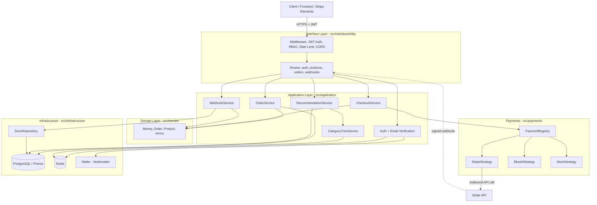

System Architecture
This document explains how the system is put together — the layers, how a request
travels through them, and where each responsibility lives. The guiding idea is a
clean separation of concerns: business rules stay isolated from the database, the
web framework, and the payment providers, so any one of those can change without
disturbing the core logic.
The layers at a glance
The code is organised into four layers, and dependencies only ever point inward.
The HTTP layer knows about the application layer, the application layer knows about
the domain, and the infrastructure layer plugs in from the outside — but the domain
at the centre knows nothing about any of them. Nothing in `src/domain` imports a
database client, an HTTP type, or a payment SDK.

How the layers fit together
Interface layer. Every request first passes through middleware — JWT
authentication and role checks, rate limiting on the auth routes, and CORS so the
Vercel frontend can call the API from the browser. The routes themselves stay thin:
they validate input, call an application service, and shape the response. They hold
no business logic.
Application layer. This is where use cases are orchestrated. `OrderService`
builds an order and computes its total from server-side prices; `CheckoutService`
resolves a payment provider and initiates payment; `RecommendationService` leans on
`CategoryTreeService` to suggest related products; `WebhookService` finalizes a
payment when the provider confirms it. Auth handling, including email verification,
also lives here.
Domain layer. The pure heart of the system. `Money` is an immutable integer
value object that makes floating-point currency bugs impossible; `Order` is a state
machine that refuses illegal transitions; `Product` guards its own stock and status
rules. Because this layer has no I/O, it is tested in milliseconds without a
database.
Payments. Providers are handled with the Strategy pattern. Each provider is a
class implementing a common interface, and a `PaymentRegistry` resolves the right
one by name at runtime. Adding a provider is one new file plus one registration
line — `CheckoutService` never changes.
Infrastructure. The outside world: PostgreSQL through Prisma, Redis, and
Nodemailer for email. `StockRepository` is worth calling out — it performs the
atomic conditional stock decrement that prevents overselling under concurrency.
Two flows worth following
A recommendation request goes API → `RecommendationService` →
`CategoryTreeService`, which serves the category tree from Redis (rebuilding from
PostgreSQL and re-caching if the cache is cold or unavailable), then queries
products in the resolved categories.
A payment goes API → `CheckoutService` → the resolved provider strategy, which
calls the provider's API and returns a client secret. Later, the provider sends a
signed webhook back to the API; `WebhookService` verifies the signature against the
raw bytes, guards against duplicates with a unique constraint, and — in a single
transaction — marks the payment successful, decrements stock atomically, and moves
the order to PAID. The detailed step-by-step is in `payment-flow.md`.
Why it is shaped this way
Keeping the domain free of I/O means business rules are fast to test and outlive any
particular database or framework choice. Routing payment providers through a
registry means the system scales to new providers without touching order logic. And
letting the database arbitrate concurrency — through the atomic stock update and the
webhook unique constraint — keeps correctness guarantees where they cannot be
defeated by a race between application instances.
