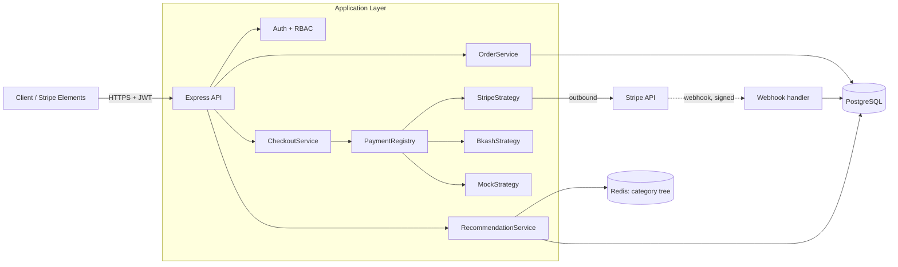

# System Architecture

```mermaid
flowchart LR
  C[Client / Stripe Elements] -->|HTTPS + JWT| API[Express API]
  subgraph app[Application Layer]
    API --> AUTH[Auth + RBAC]
    API --> ORD[OrderService]
    API --> CHK[CheckoutService]
    API --> REC[RecommendationService]
    CHK --> REG[PaymentRegistry]
    REG --> ST[StripeStrategy]
    REG --> BK[BkashStrategy]
    REG --> MK[MockStrategy]
  end
  ORD --> PG[(PostgreSQL)]
  REC --> RD[(Redis: category tree)]
  REC --> PG
  ST -->|outbound| STRIPE[Stripe API]
  STRIPE -.->|webhook, signed| WH[Webhook handler]
  WH --> PG
```
