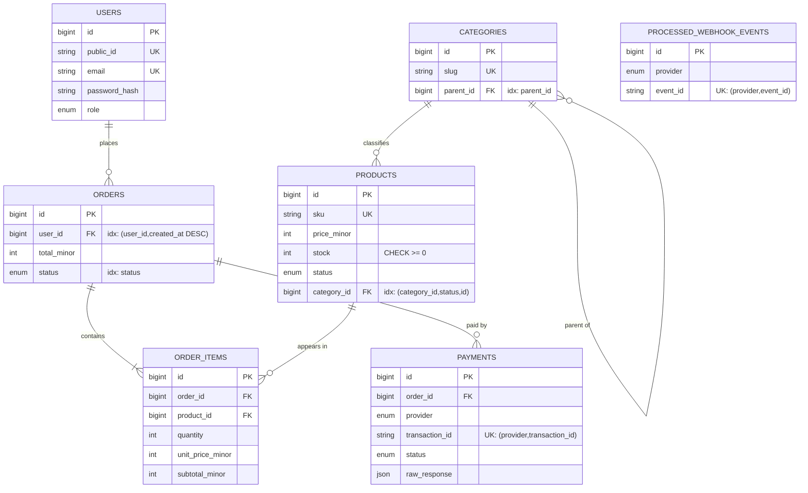

# Entity Relationship Diagram

```mermaid
erDiagram
  USERS ||--o{ ORDERS : places
  ORDERS ||--|{ ORDER_ITEMS : contains
  ORDERS ||--o{ PAYMENTS : "paid by"
  PRODUCTS ||--o{ ORDER_ITEMS : "appears in"
  CATEGORIES ||--o{ PRODUCTS : classifies
  CATEGORIES ||--o{ CATEGORIES : "parent of"

  USERS {
    bigint id PK
    string public_id UK
    string email UK
    string password_hash
    enum role
  }
  CATEGORIES {
    bigint id PK
    string slug UK
    bigint parent_id FK "idx: parent_id"
  }
  PRODUCTS {
    bigint id PK
    string sku UK
    int price_minor
    int stock "CHECK >= 0"
    enum status
    bigint category_id FK "idx: (category_id,status,id)"
  }
  ORDERS {
    bigint id PK
    bigint user_id FK "idx: (user_id,created_at DESC)"
    int total_minor
    enum status "idx: status"
  }
  ORDER_ITEMS {
    bigint id PK
    bigint order_id FK
    bigint product_id FK
    int quantity
    int unit_price_minor
    int subtotal_minor
  }
  PAYMENTS {
    bigint id PK
    bigint order_id FK
    enum provider
    string transaction_id "UK: (provider,transaction_id)"
    enum status
    json raw_response
  }
  PROCESSED_WEBHOOK_EVENTS {
    bigint id PK
    enum provider
    string event_id "UK: (provider,event_id)"
  }
```
