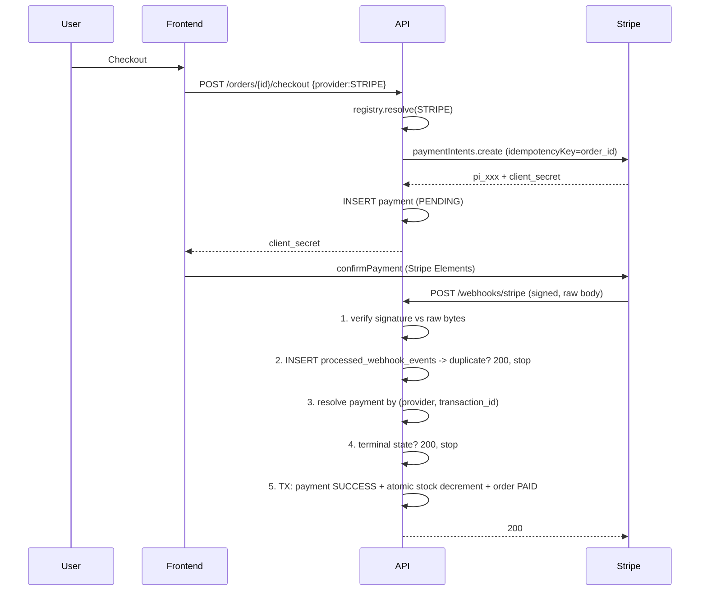
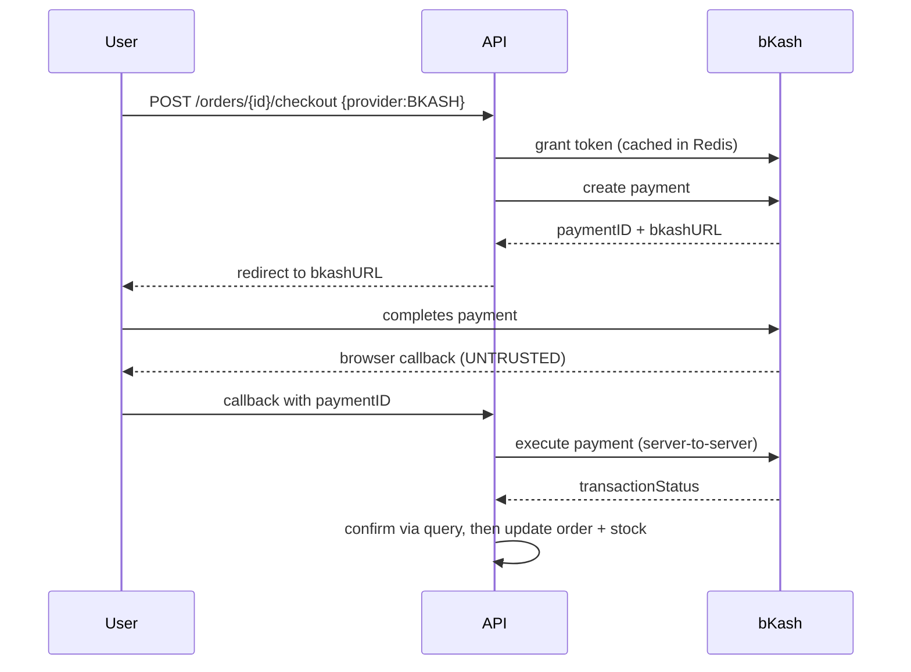
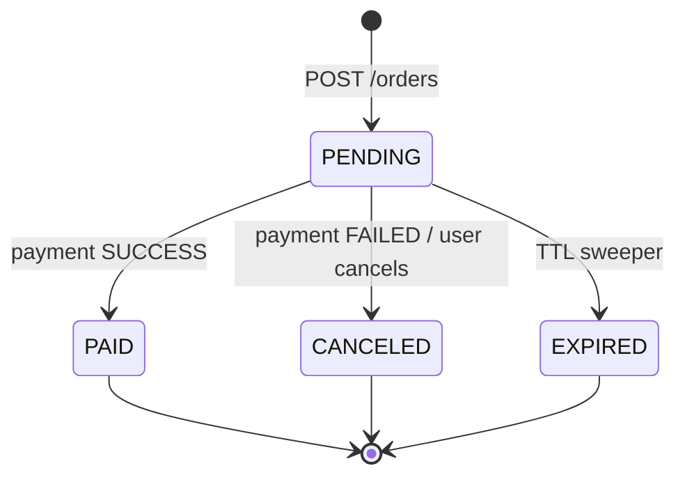

# Payment Flow Diagrams

## Stripe (webhook-driven)

```mermaid
sequenceDiagram
  participant U as User
  participant F as Frontend
  participant A as API
  participant S as Stripe
  U->>F: Checkout
  F->>A: POST /orders/{id}/checkout {provider:STRIPE}
  A->>A: registry.resolve(STRIPE)
  A->>S: paymentIntents.create (idempotencyKey=order_id)
  S-->>A: pi_xxx + client_secret
  A->>A: INSERT payment (PENDING)
  A-->>F: client_secret
  F->>S: confirmPayment (Stripe Elements)
  S->>A: POST /webhooks/stripe (signed, raw body)
  A->>A: 1. verify signature vs raw bytes
  A->>A: 2. INSERT processed_webhook_events -> duplicate? 200, stop
  A->>A: 3. resolve payment by (provider, transaction_id)
  A->>A: 4. terminal state? 200, stop
  A->>A: 5. TX: payment SUCCESS + atomic stock decrement + order PAID
  A-->>S: 200
```

## bKash (callback + execute)

```mermaid
sequenceDiagram
  participant U as User
  participant A as API
  participant B as bKash
  U->>A: POST /orders/{id}/checkout {provider:BKASH}
  A->>B: grant token (cached in Redis)
  A->>B: create payment
  B-->>A: paymentID + bkashURL
  A-->>U: redirect to bkashURL
  U->>B: completes payment
  B-->>U: browser callback (UNTRUSTED)
  U->>A: callback with paymentID
  A->>B: execute payment (server-to-server)
  B-->>A: transactionStatus
  A->>A: confirm via query, then update order + stock
```

## Order state machine

```mermaid
stateDiagram-v2
  [*] --> PENDING: POST /orders
  PENDING --> PAID: payment SUCCESS
  PENDING --> CANCELED: payment FAILED / user cancels
  PENDING --> EXPIRED: TTL sweeper
  PAID --> [*]
  CANCELED --> [*]
  EXPIRED --> [*]
```
